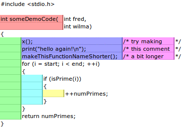

Copied for safe-keeping from https://nickgravgaard.com/elastic-tabstops/ on 2021-02-09

----

> The elastic tabstops mechanism was invented by Nick Gravgaard in the summer of 2006.
> All text and images on this page are copyright Nick Gravgaard and licensed under a Creative Commons Attribution 3.0 Licence.

----

## Intro \- the status quo sucks

Since the days of the character mapped display, programmers have argued over whether tabs or spaces should be used to line up text. While both strategies can be used if all of a project's programmers can agree on how many spaces wide a tab should be, experience has taught us that this is not always the case. Even if all of the programmers working on a project are diligent enough to stick to only using tabs or spaces and have tabs set to the agreed number of spaces, there is still a problem if any programmers wish to use modern proportional fonts (because a space is no longer the same width as every other character).

The reason why we have not yet settled conclusively on either tabs or spaces is that both camps can point to problems in the others' approach. The truth is that both are right to be critical \- both solutions are inadequate as neither allows different programmers to look at the same file and have their indentation and columns as wide or as thin as they'd like without text getting misaligned. Using spaces to align columns is obviously a kludge, but tabs as they stand now are broken.

## The solution \- move tabstops to fit the text between them and align them with matching tabstops on adjacent lines

For as long as we continue to define each tabstop as being a multiple of N characters we will never be able to solve this problem satisfactorily. The problem is that we're using tabs and spaces to format text for aesthetic reasons rather than treating them semantically \- tabs are for indenting and aligning text, spaces are for separating keywords.

The simple solution is to redefine how tabs are interpreted by the text editor. Rather than saying that a tab character places the text that follows it at the next Nth column, we should say that a tab character is a delimiter between table cells in a manner more reminiscent of how they're used in tab separated value (TSV) files. When used for text or code I call this format "Tab Separated Columns". Seen in this light, we can see that space aligned files are analogous to the old fixed width data files, and we all know the advantages that delimited files have over those. For one thing, you can use sed or other tools to substitute strings in files and everything will still line up when you load them in the editor. Another advantage is that proportional fonts can now be used (in itself not a new idea \- see [Smalltalk](https://nickgravgaard.com/elastic-tabstops/images/smalltalk.png), [Oberon](https://nickgravgaard.com/elastic-tabstops/images/oberon.png) and Plan 9's [Acme](https://nickgravgaard.com/elastic-tabstops/images/acme.png)).

This animated diagram shows how the elastic tabstops mechanism aligns text. A tab character is represented as a vertical line.

Each *cell* ends with a tab character. A *column block* is a run of uninterrupted vertically adjacent *cells*. A *column block* is as wide as the widest piece of text in the *cells* it contains or a minimum width (plus padding). Text outside *column blocks* is ignored.

## Try it right now

I used to have a Java applet embedded here, but modern browsers no longer support unsigned applets. The best way to try out the concept is to download [Elastic Notepad](https://github.com/nickgravgaard/ElasticNotepad/releases) (and look at the [core elastic tabstops code](https://github.com/nickgravgaard/ElasticNotepad/blob/master/app/src/elasticTabstops.scala) if you want to see how to implement it). Alternatively you can still download the original Java versions from 2006 by following the links on [this page](https://nickgravgaard.com/elastic-tabstops/new-demo).

## Keep it simple, stupid!

This solution is as simple as possible, and is arguably simpler conceptually than the old mod\-N model (although a bit more work computationally, which is probably why they went with the mod\-N system back in the 1970s). When HTML's designers considered tables I'm sure they never thought about reimplementing the old mod\-N model, and no one would ever say that HTML tables are complicated or in any way intelligent. The elastic tabstops mechanism is the same \- as simple as possible, but no simpler. Just like the mod\-N model it seeks to replace it doesn't care about what the text between tabs is, and nor should it.

Every so often someone will show how they can make code align in a funny way by laying out their code just so, and then go on to come up with a complicated context sensitive and language dependant scheme which fixes that particlar edge case. A better and simpler solution is simply "don't do that, then". Existing code conventions evolved in an environment where displays were character based and tabstops were every N columns. It's not hard to imagine new conventions evolving in a new environment where proportional fonts are possible and text always stays lined up properly.

## Forwards compatibility

While editors which haven't yet implemented the elastic tabstops mechanism may not align some text properly in files where tabs were used with elastic tabstops, the problem isn't that bad. All leading tabs (indentation) will be okay, and the chances of text not aligning correctly diminishes as the width between tabstops increases. So if you plan on switching to elastic tabstops in the future, and wish to choose a code style with that in mind (to use now), I suggest using tabs with fixed tabstops every 8 characters (or more) across. Alternatively co\-workers can use tabs with fixed tabstops of whatever size they like as long as no one tries to line up text for anything other than indentation.

## Current implementations

*   [Elastic Notepad](https://github.com/nickgravgaard/ElasticNotepad), my reference implementation written in Scala, and a fledgling cross\-platform text\-editor in its own right
*   [Always Aligned VS](https://github.com/nickgravgaard/AlwaysAlignedVS), my extension which implements [elastic tabstops for Visual Studio](https://github.com/nickgravgaard/AlwaysAlignedVS)
*   My [implementation](https://github.com/nickgravgaard/ElasticTabstopsForScintilla) for the widely used Scintilla text widget
*   My original [Java Swing app](https://nickgravgaard.com/elastic-tabstops/new-demo)
*   My original [Gedit plugin](https://nickgravgaard.com/elastic-tabstops/gedit) (no longer compatible with Gedit's changed API)
*   [Komodo IDE](http://komodoide.com), a cross\-platform IDE for Python, PHP, Go, Perl, Tcl, Ruby, NodeJS, HTML, CSS, JavaScript, and more
*   [jEdit](http://www.jedit.org), a programmer's text editor (note this can be used with [JDiffPlugin](http://plugins.jedit.org/plugins/?JDiffPlugin) to diff files formatted with elastic tabstops)
*   [Code Browser](http://tibleiz.net/code-browser/), a folding text editor for Linux and Windows
*   [MultiMarkdown Composer 2](http://multimarkdown.com) (OS X only unfortunately)
*   [Inform 7](http://inform7.com), an IDE for programming interactive fiction
*   A [plugin](https://atom.io/packages/elastic-tabstops) for the [Atom](https://atom.io/) editor (repo [here](https://github.com/hax/atom-elastic-tabstops))
*   A [plugin](https://github.com/dail8859/ElasticTabstops/releases) for [Notepad++](https://notepad-plus-plus.org/), a widely used text editor for Windows
*   A [plugin](http://foicica.com/wiki/elastic-tabstops) for [Textadept](http://foicica.com/textadept/) (a nice cross\-platform programmer's text editor)
*   Google's [Go programming language](http://en.wikipedia.org/wiki/Go_%28programming_language%29) (made by [Rob Pike](http://en.wikipedia.org/wiki/Rob_Pike) and [Ken Thompson](http://en.wikipedia.org/wiki/Ken_Thompson) (amongst others) who were also responsible for [UTF\-8](http://en.wikipedia.org/wiki/UTF-8)) uses elastic tabstops in it's ["tabwriter" package](http://golang.org/pkg/tabwriter/) used by [gofmt](https://golang.org/cmd/gofmt/).
*   A [user script](https://github.com/hax/etab) which adds elastic tabstops support to GitHub (currently only tested under [Tampermonkey](http://tampermonkey.net/)). Use this to view GitHub repos which use elastic tabstops.
*   [etst](https://github.com/sbuller/etst) is a command line program written in C++ which converts text using elastic tabstops to spaces
*   Some [Haskell code](http://dpwright.com/posts/2015/05/02/generating-this-website-part-6-elastic-tabstops/) which adds elastic tabstops to [Pandoc](http://pandoc.org/)

## Potential implementations

*   On Microsoft's open source .NET GitHub repo there's [an issue about aligning text](https://github.com/dotnet/roslyn/issues/16088) where elastic tabstops was mentioned. I think it would be great if elastic tabtops was an option in Visual Studio, or even just used by a code formatter the way [Google's gofmt](https://golang.org/cmd/gofmt/) uses it. If you feel the same, go and tell them [here](https://github.com/dotnet/roslyn/issues/16088).
*   My [Eclipse](http://www.eclipse.org/) plugin is currently stalled until [this bug](https://bugs.eclipse.org/bugs/show_bug.cgi?id=318356) gets fixed. Go and vote for it.

## Incorrect implementations

*   SublimeText's "ElasticTabstops" plugin inserts spaces rather than moving tabstops. If there are no tabstops (or tabs) it can't be elastic tabstops.
*   The authors of the ACE browser\-based editor copied the SublimeText plugin (so it's broken too).

## See also

*   [Input, a proportional programming font](http://input.fontbureau.com/info/) works brilliantly with elastic tabstops. I look forward to seeing more fonts like this.

## The name "elastic tabstops"

Some people have mistakenly called this "elastic tabs" rather than "elastic tabstops", presumably because they don't realise that tabs and tabstops are different things. For a feature to be called "elastic tabstops" it needs to move tabstops (there's a clue in the name :)
